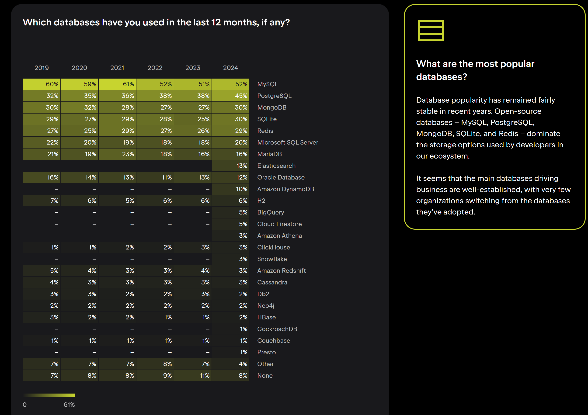

# MySQL 소개

MySQL은 오픈 소스 관계형 데이터베이스 관리 시스템(RDBMS)으로, 세계적으로 가장 많이 사용되는 데이터베이스 중 하나입니다. MySQL은 다중 사용자, 다중 스레드를 지원하며, 다양한 운영 체제에서 사용할 수 있습니다. 또한 MySQL은 다양한 프로그래밍 언어를 지원하며, 다양한 클라이언트 프로그램과 연동할 수 있습니다.

MySQL은 엔터프라이즈 에디션과 MySQL 커뮤니티 에디션으로 두 가지가 있습니다.

별도의 라이선스를 구매하지 않아도 무료로 사용할 수 있는 MySQL 커뮤니티 에디션은 오픈 소스로 제공되며, 소스 코드를 수정하여 자신의 프로그램에 적용할 수 있습니다. MySQL 커뮤니티 에디션은 MySQL 데이터베이스 서버, MySQL 클라이언트 프로그램, MySQL 워크벤치, MySQL 샘플 데이터베이스 등을 포함하고 있습니다.

MySQL 5.5 버전 이하에서는 두 에디션의 차이가 얼마나 자주 패치 버전이 릴리스되느냐 정도였습니다.

2011년 2월 MySQL 5.5 GA 버전부터는 엔터프라이즈 에디션의 소스코드가 공개되지 않고, 커뮤니티 에디션의 소스코드만 공개되었습니다.

# Why MySQL?

DBMS를 비교할 때 MySQL은 다음과 같은 이유로 선택되는 경우가 많습니다:

## DBMS 선택할 때 고려사항
1. **안정성**
2. **성능과 기능**
3. **커뮤니티나 인지도**

JetBrains 2024 설문조사
