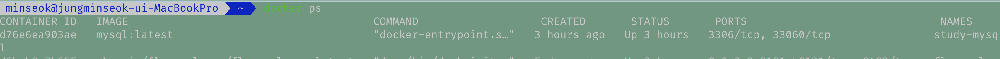

### 도커 설치 확인


```
$ docker -v 
Docker version 24.0.6, build ed223bc
```


### pull mysql

[docker hub (mysql)](https://hub.docker.com/_/mysql)

도커 허브에서 현재 mysql 이미지를 확인할 수 있다.

아래 명령어를 통해 mysql 이미지를 pull한다. (버전 태그 지정 안할 시 latest 버전)
```
$ docker pull mysql

Using default tag: latest
latest: Pulling from library/mysql
ce92cb084937: Pull complete
2303f4a62c55: Pull complete
d763704225c6: Pull complete
d056028b9c18: Pull complete
69b1500def33: Pull complete
065a61ce0ce9: Pull complete
f7c8f411b1fa: Pull complete
beffef775ec7: Pull complete
ba7720939c9d: Pull complete
d921a3558c36: Pull complete
Digest: sha256:9b9d0aab4860798acff13d2a0ece3bc26639fe18b83fa5cd3e3d0e16b3ed05dd
Status: Downloaded newer image for mysql:latest
docker.io/library/mysql:latest
```


```
$ docker images | grep mysql
mysql     latest      75f28080e883   2 months ago   814MB
mysql     8.4.3       27efc117602e   5 months ago   601MB (버전 태그 명시)
```


```
$ docker run --name some-mysql -e MYSQL_ROOT_PASSWORD=your-secret-pw -d mysql:tag

```

```
$ docker run --name study-mysql -e MYSQL_ROOT_PASSWORD=asdf -p 3306:3306 -d mysql:latest
```


```
$ docker ps 
CONTAINER ID   IMAGE    COMMAND   CREATED  STATUS   PORTS  NAMES
d76e6ea903ae   mysql:latest "docker-entrypoint.s…"   3 hours ago   Up 3 hours   3306/tcp, 33060/tcp  study-mysql
```

```
$ docker logs study-mysql
2025-03-24 00:23:07+00:00 [Note] [Entrypoint]: Entrypoint script for MySQL Server 9.2.0-1.el9 started.
2025-03-24 00:23:07+00:00 [Note] [Entrypoint]: Switching to dedicated user 'mysql'
2025-03-24 00:23:07+00:00 [Note] [Entrypoint]: Entrypoint script for MySQL Server 9.2.0-1.el9 started.
2025-03-24 00:23:07+00:00 [Note] [Entrypoint]: Initializing database files
2025-03-24T00:23:08.001250Z 0 [System] [MY-015017] [Server] MySQL Server Initialization - start.
2025-03-24T00:23:08.002894Z 0 [System] [MY-013169] [Server] /usr/sbin/mysqld (mysqld 9.2.0) initializing of server in progress as process 81
2025-03-24T00:23:08.013395Z 1 [System] [MY-013576] [InnoDB] InnoDB initialization has started.
...
```
docker logs 확인


```
$ docker exec -it study-mysql bash
bash-5.1# mysql -u root -p
Enter password:
Welcome to the MySQL monitor.  Commands end with ; or \g.
Your MySQL connection id is 10
Server version: 9.2.0 MySQL Community Server - GPL

Copyright (c) 2000, 2025, Oracle and/or its affiliates.

Oracle is a registered trademark of Oracle Corporation and/or its
affiliates. Other names may be trademarks of their respective
owners.

Type 'help;' or '\h' for help. Type '\c' to clear the current input statement.

mysql>

```


```
mysql> show databases;
+--------------------+
| Database           |
+--------------------+
| information_schema |
| mysql              |
| performance_schema |
| sys                |
+--------------------+
4 rows in set (0.04 sec)

mysql>
```
데이터베이스 확인