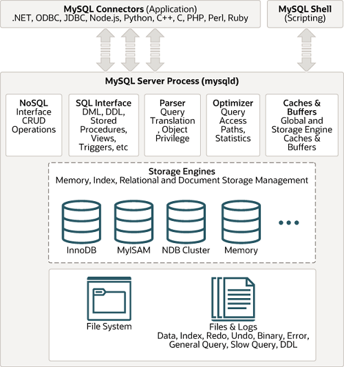
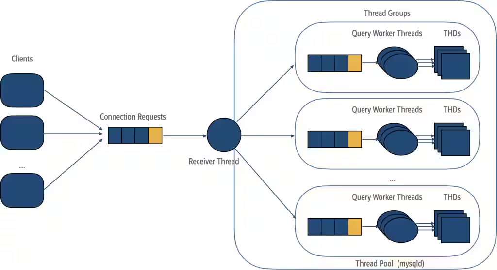
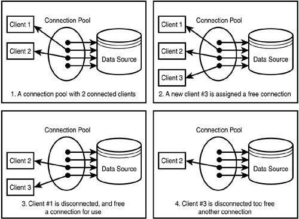
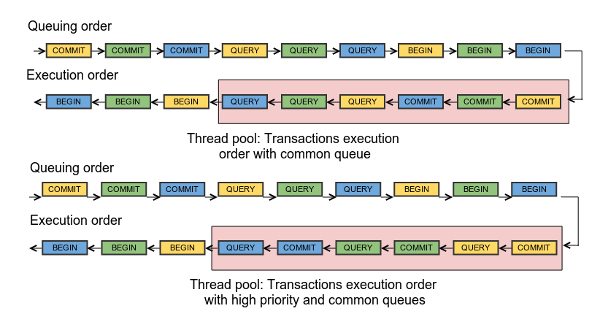
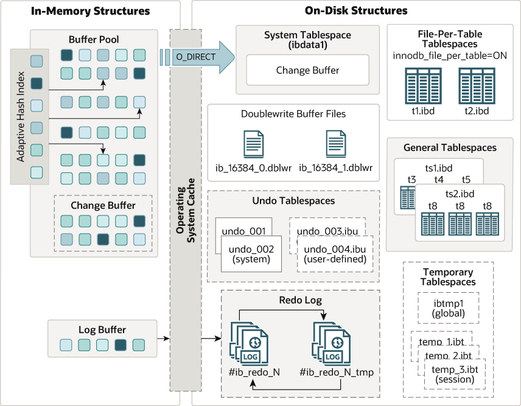
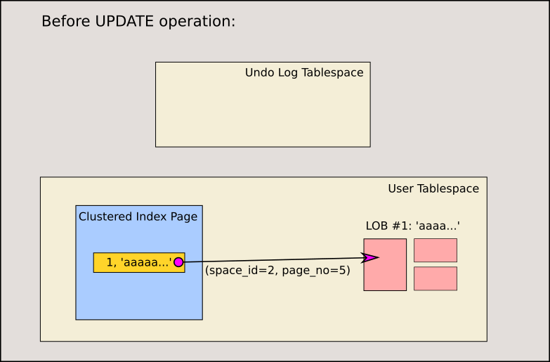
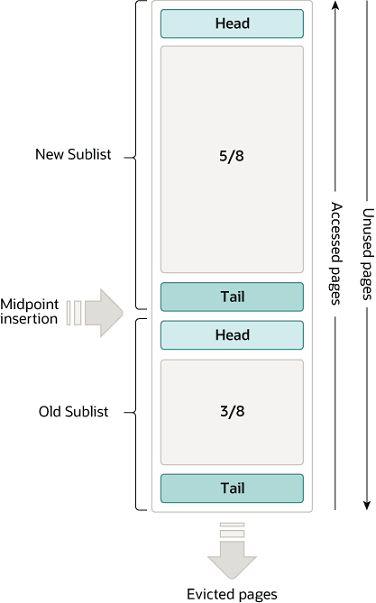
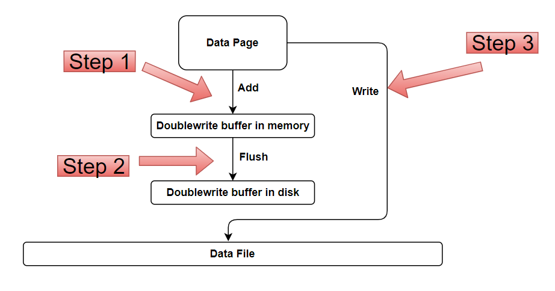

# 아키텍처

## MySQL 엔진 아키텍처 

### MySQL 전체 구조


[출처](https://dev.mysql.com/doc/refman/8.4/en/pluggable-storage-overview.html#mysql-architecture-diagram)

MySQL 서버는 크게 MySQL 엔진과 스토리지 엔진으로 구분할 수 있다.


### MySQL 엔진

MySQL 엔진은 아래와 같이 나눌 수 있다.

- 클라이언트로부터의 접속 및 쿼리 요청을 처리하는 커넥션 핸들러
- SQL 파서 및 전 처리기
- 쿼리의 최적화된 실행을 위한 옵티마이저

또한 MySQL은 표준 SQL(American National Standards Institute, ANSI SQL)을 지원하기에 표준 문법에 맞는 쿼리를 작성하면 타 DBMS에서도 실행될 수 있다.


### 스토리지 엔진

MySQL 엔진은 요청된 SQL 문장을 분석하거나 최적화하는 등 DBMS의 두뇌에 해당하는 처리를 수행한다.
실제 데이터를 디스크 스토리지에 저장하거나 디스크 스토리지로부터 데이터를 읽어오는 부분은 **스토리지 엔진**이 담당한다.

MySQL 서버에서 MySQL 엔진은 **하나**지만 스토리지 엔진은 **여러 개**를 동시에 사용할 수 있다.

다음 예제와 같이 테이블이 사용할 스토리지 엔진을 지정하면 해당 테이블의 모든 읽기, 변경 작업은 해당 스토리지 엔진을 통해 수행된다.

```sql
CREATE TABLE t (i INT) ENGINE = INNODB;
```


### 핸들러 API 

MySQL 엔진의 쿼리 실행기에서 데이터를 쓰거나 읽어야 할 때는 각 스토리지 엔진에 쓰기 또는 읽기를 요청한다.

이러한 요청을 **핸들러(Handler) 요청**이라 하고 여기서 사용되는 API를 **핸들러 API**라고 한다.

```sql
SHOW GLOBAL STATUS LIKE 'Handler%';

+----------------------------+-------+
| Variable_name              | Value |
+----------------------------+-------+
| Handler_commit             | 602   |
| Handler_delete             | 8     |
| Handler_discover           | 0     |
| Handler_external_lock      | 6321  |
| Handler_mrr_init           | 0     |
| Handler_prepare            | 0     |
| Handler_read_first         | 41    |
| Handler_read_key           | 1736  |
| Handler_read_last          | 0     |
| Handler_read_next          | 4053  |
| Handler_read_prev          | 0     |
| Handler_read_rnd           | 0     |
| Handler_read_rnd_next      | 201   |
| Handler_rollback           | 0     |
| Handler_savepoint          | 0     |
| Handler_savepoint_rollback | 0     |
| Handler_update             | 331   |
| Handler_write              | 8     |
+----------------------------+-------+
18 rows in set (0.01 sec)
```

(핸들러 API를 통해 얼마나 많은 데이터 작업이 있는지 확인)


## MySQL 스레딩 구조


[출처](https://dev.mysql.com/blog-archive/the-new-mysql-thread-pool/)

MySQL은 프로세스 기반이 아니라 스레드 기반으로 작동하며, 아래와 같이 구분할 수 있다.

- 포그라운드 스레드
- 백그라운드 스레드

```sql
SELECT thread_id, name, type, processlist_user, processlist_host
FROM performance_schema.threads
ORDER BY type, thread_id;

+-----------+---------------------------------------------+------------+------------------+------------------+
| thread_id | name                                        | type       | processlist_user | processlist_host |
+-----------+---------------------------------------------+------------+------------------+------------------+
|         1 | thread/sql/main                             | BACKGROUND | NULL             | NULL             |
|         3 | thread/innodb/io_ibuf_thread                | BACKGROUND | NULL             | NULL             |
|         4 | thread/innodb/io_read_thread                | BACKGROUND | NULL             | NULL             |
|         5 | thread/innodb/io_read_thread                | BACKGROUND | NULL             | NULL             |
|         6 | thread/innodb/io_read_thread                | BACKGROUND | NULL             | NULL             |
|         7 | thread/innodb/io_read_thread                | BACKGROUND | NULL             | NULL             |
|         8 | thread/innodb/io_read_thread                | BACKGROUND | NULL             | NULL             |
|         9 | thread/innodb/io_read_thread                | BACKGROUND | NULL             | NULL             |
|        10 | thread/innodb/io_write_thread               | BACKGROUND | NULL             | NULL             |
|        11 | thread/innodb/io_write_thread               | BACKGROUND | NULL             | NULL             |
|        12 | thread/innodb/io_write_thread               | BACKGROUND | NULL             | NULL             |
|        13 | thread/innodb/io_write_thread               | BACKGROUND | NULL             | NULL             |
|        14 | thread/innodb/page_flush_coordinator_thread | BACKGROUND | NULL             | NULL             |
|        16 | thread/innodb/log_checkpointer_thread       | BACKGROUND | NULL             | NULL             |
|        17 | thread/innodb/log_flush_notifier_thread     | BACKGROUND | NULL             | NULL             |
|        18 | thread/innodb/log_flusher_thread            | BACKGROUND | NULL             | NULL             |
|        19 | thread/innodb/log_write_notifier_thread     | BACKGROUND | NULL             | NULL             |
|        20 | thread/innodb/log_writer_thread             | BACKGROUND | NULL             | NULL             |
|        21 | thread/innodb/log_files_governor_thread     | BACKGROUND | NULL             | NULL             |
|        26 | thread/innodb/srv_lock_timeout_thread       | BACKGROUND | NULL             | NULL             |
|        27 | thread/innodb/srv_error_monitor_thread      | BACKGROUND | NULL             | NULL             |
|        28 | thread/innodb/srv_monitor_thread            | BACKGROUND | NULL             | NULL             |
|        29 | thread/innodb/buf_resize_thread             | BACKGROUND | NULL             | NULL             |
|        30 | thread/innodb/srv_master_thread             | BACKGROUND | NULL             | NULL             |
|        31 | thread/innodb/dict_stats_thread             | BACKGROUND | NULL             | NULL             |
|        32 | thread/innodb/fts_optimize_thread           | BACKGROUND | NULL             | NULL             |
|        33 | thread/mysqlx/worker                        | BACKGROUND | NULL             | NULL             |
|        34 | thread/mysqlx/worker                        | BACKGROUND | NULL             | NULL             |
|        35 | thread/mysqlx/acceptor_network              | BACKGROUND | NULL             | NULL             |
|        39 | thread/innodb/buf_dump_thread               | BACKGROUND | NULL             | NULL             |
|        40 | thread/innodb/clone_gtid_thread             | BACKGROUND | NULL             | NULL             |
|        41 | thread/innodb/srv_purge_thread              | BACKGROUND | NULL             | NULL             |
|        43 | thread/sql/signal_handler                   | BACKGROUND | NULL             | NULL             |
|        44 | thread/mysqlx/acceptor_network              | BACKGROUND | NULL             | NULL             |
|        42 | thread/sql/event_scheduler                  | FOREGROUND | event_scheduler  | localhost        |
|        46 | thread/sql/compress_gtid_table              | FOREGROUND | NULL             | NULL             |
|        52 | thread/sql/one_connection                   | FOREGROUND | root             | localhost        |
+-----------+---------------------------------------------+------------+------------------+------------------+
37 rows in set (0.01 sec)
```


### 포그라운드 스레드
포그라운드 스레드는 MySQL 서버에 접속된 클라이언트 수만큼 존재한다.
주로 각 클라이언트가 요청하는 쿼리 문장을 처리한다.

클라이언트가 작업을 마치고 커넥션이 종료된다면, 해당 커넥션을 담당하던 스레드는 다시 thread cache로 돌아가며, 이 때 일정 개수 이상의 대기중인 스레드가 있다면 캐시에 넣지않고 스레드를 종료시켜 일정 개수의 스레드만 캐시에 남겨둔다.

스레드 캐시에 유지할 수 있는 최대 스레드 개수는 [thread_cache_size](https://dev.mysql.com/doc/refman/8.4/en/server-system-variables.html#sysvar_thread_cache_size)로 설정할 수 있다.

```sql
SHOW VARIABLES LIKE 'thread_cache_size';
```

포그라운드 스레드는 다음과 같은 작업을 수행한다.

- 데이터를 MySQL의 데이터 버퍼나 캐시로 부터 가져온다.
  - 버퍼나 캐시에 없는 경우에는 직접 디스크의 데이터나 인덱스 파일로부터 데이터를 읽어와서 작업 처리
- MyISAM 테이블은 디스크 쓰기 까지 포그라운드 스레드가 처리
- InnoDB 테이블은 디스크 쓰기는 백그라운드 스레드가 처리하며, 포그라운드 스레드는 데이터 버퍼나 캐시까지만 포그라운드 스레드가 처리


### 백그라운드 스레드

MyISAM의 경우에는 해당사항이 없는 부분이지만 InnoDB는 다음과 같이 여러 작업을 처리한다.

- Insert Buffer를 병합하는 스레드
- 로그를 디스크로 기록하는 스레드
- InnoDB 버퍼 풀의 데이터를 디스크에 기록하는 스레드
- 데이터를 버퍼로 읽어 오는 스레드
- 잠금이나 데드락을 모니터링하는 스레드

가장 중요한 것은 Log thread와 Write thread일 것이다.
MySQL 5.5 버전 이후, 데이터 쓰기 스레드와 읽기 스레드의 개수를 2개 이상 지정할 수 있게 되었다.

```sql
SHOW VARIABLES LIKE 'innodb_read_io_threads';
SHOW VARIABLES LIKE 'innodb_write_io_threads';
```

write thread는 일반적인 내장 디스크를 사용할 때는 2~4 정도, DAS나 SAN을 사용할 때는 최적으로 사용할 수 있을만큼 충분히 설정


### 메모리 할당 및 사용 구조

글로벌 메모리 영역
- InnoDB 버퍼 풀
- MyISAM 키 캐시
- 바이너리 로그 버퍼
- 리두 로그 버퍼
- 테이블 캐시

글로벌 메모리 영역의 모든 메모리 공간은 MySQL 서버가 시작되면서 운영체제로부터 할당된다.
일반적으로 클라이언트 스레드 수와 무관하게 하나의 메모리 공간만 할당, 필요에 따라 2개 이상 할당 받을 수 있다.

세션(커넥션) 메모리 영역
- 조인 버퍼
- 정렬 버퍼
- 네트워크 버퍼
- 리드 버퍼

MySQL 서버상 존재하는 클라이언트 스레드가 쿼리를 처리하는데 사용하는 메모리 영역
클라이언트가 MySQL서버에 접속하면 클라이언트 커넥션으로부터 요청을 받기 위해 스레드를 하나씩 할당받게 된다. (AKA 클라이언트 메모리 영역)

로컬 메모리는 각 클라이언트 스레드별로 독립적으로 할당되며 절대 공유되지 않는다.

- sort buffer와 같은 로컬 메모리 영역은 크게 신경 쓰지 않고 설정
  - but, 최악의 경우에는 MySQL 서버가 갑자기 멈수 있으므로 적절한 크기로 설정하는 것이 좋다.
- 각 쿼리의 용도별로 필요할 때만 공간이 할당되고 필요하지 않은 경우에 메모리 공간을 할당조차 하지 않을 수 있다.
  - ex) sort buffer, join buffer 
- 커넥션이 열려있는 동안 계속 할당된 상태로 남아있는 공간도 있다 (커넥션 버퍼, 결과 버퍼)
- 그렇지 않고 쿼리를 실행하는 순간에만 할당했다 다시 해제 (sort buffer, join buffer)


## 쿼리 실행 구조


### 쿼리 파서
쿼리 파서는 사용자 요청으로 들어온 쿼리 문장을 토큰으로 분리해 트리 형태의 구조로 만들어낸다.
쿼리 문장의 기본 문법 오류는 이때 발견된다.

### 전처리기
파서 과정에서 만들어진 파서 트리를 기반으로 쿼리 문장에 구조적 문제가 있는지 확인.
각 토큰을 분석하고 테이블 이름, 컬럼 이름, 내장 함수와 같은 개체로 매핑해 존재 여부 확인 및 접근 권한 확인


### 옵티마이저
사용자의 요청으로 들어온 쿼리 문장을 저렴한 비용으로 가장 빠르게 처리할 수 있는 방법을 찾는다.
DBMS의 두뇌에 해당한다. 

### 실행 엔진
옵티마이저가 두뇌라면, 실행 엔진과 핸들러는 손과 발에 비유

예시로 옵티마이저가 GROUP BY를 처리하기 위해 임시 테이블을 사용하기로 결정했다고 가정.

1. 실행 엔진이 핸들러에게 임시 테이블 만들라고 요청
2. 실행엔진은 WHERE절에 일치한 레코드를 읽어오라고 핸들러에게 요청
3. 읽어온 레코드들을 1번에서 준비한 임시 테이블에 저장하라고 핸들러에게 요청
4. 데이터가 준비된 임시테이블에서 필요한 방식으로 데이터를 읽어오라고 핸들러에게 다시 요청
5. 최종적으로 실행 엔진은 결과를 사용자나 다른 모듈로 넘김 

### 핸들러
MySQL 서버 가장 밑단에서 실행엔진의 요청에 따라 데이터를 디스크로 저장, 디스크로 읽어오는 역할 담당
핸들러는 곧 **스토리지 엔진**을 의미한다.

## 쿼리 캐시 
빠른 응답을 필요로하는 웹 기반 프로그램에서 중요한 역할 담당.

쿼리 캐시는 SQL의 실행 결과를 메모리에 캐시하고, 동일 SQL 쿼리가 실행되면 테이블을 조회하지 않고 캐시된 결과를 반환한다.

단, 테이블의 데이터가 변경되면 캐시에 저장된 결과 중 변경된 테이블과 관련된 모든 것을 삭제해야해서 동시 처리 성능 저하로 이어짐
-> MySQL 8.0부터 쿼리 캐시는 완전히 제거되고 관련 시스템 변수도 제거되었다.


## 스레드 풀

스레드 풀은 내부적으로 사용자의 요청을 처리하는 스레드 개수를 줄여서 동시 처리되는 요청이 많다 하더라도 CPU가 제한 된 개수의 스레드 처리에만 집중할 수 있게해서,
**서버의 자원 소모를 줄이는 것이 목적이다**.

스레드 풀을 설치한다고 단순히 성능이 올라가는 것이 아니고, 제한된 수의 스레드만으로 CPU가 잘 처리할 수 있도록 유도하여 CPU의 Processor affinity를 높이고 불필요한 context switching을 줄여서 오버헤드를 낮출 수 있다.


스레드 그룹의 개수는 [thread_pool_size](https://dev.mysql.com/doc/refman/8.0/en/server-system-variables.html#sysvar_thread_pool_size)로 설정할 수 있다.

일반적으로 CPU 코어의 개수와 맞추는 것이 Processor affinity를 높이는데 도움이 된다.
MySQL 서버가 처리해야할 요청이 생기면 스레드 풀로 이관되는데, 만약 이미 스레드풀이 처리중인 작업이 있는 경우 thread_pool_oversubscribe 옵션을 사용하여 스레드 풀에 추가로 스레드를 생성할 수 있다.
물론 이 값이 너무 크면 스케줄링할 스레드가 많아져 비효율적으로 작동할 수 있다.

스레드 그룹의 모든 스레드가 일을 처리하고 있다면 해당 스레드 그룹에 새로운 Worker thread를 추가할지, 기다릴지 여부를 판단해야한다.
[thread_pool_stall_limit](https://dev.mysql.com/doc/refman/8.0/en/server-system-variables.html#sysvar_thread_pool_stall_limit) 시스템 변수에 정의된 ms만큼 worker thread가 일을 처리하지 못하면 스레드 그룹에 새로운 Worker thread를 추가한다.

이 때 전체 스레드 풀에 있는 스레드의 개수는 thread_pool_max_threads로 제한된다.

**즉, 모든 스레드 그룹의 스레드가 각자 작업 처리 중 새로운 요청이 들어오더라도 스레드 풀은 thread_pool_stall_limit 시간동안 기다려야 한다.**
따라서 적절히 낮춰서 설정해야하고 그렇다고 0에 가까운 값으로 설정하는 것은 권하지 않는다.



[Percona server](https://www.percona.com/blog/percona-server-thread-pool-improvements/)

## InnoDB 스토리지 엔진 아키텍처


[출처](https://dev.mysql.com/doc/refman/8.4/en/innodb-architecture.html)

### PK에 의한 클러스터링
InnoDB는 테이블을 생성할 때 기본적으로 PK를 기준으로 클러스터링되어 저장된다.
즉, PK의 값 순서대로 디스크에 저장되며, 모든 세컨더리 인덱스는 PK의 값을 논리적 주소로 사용한다.

-> PK를 이용한 range scan은 상당히 빨리 처리될 수 있다.

### FK 지원
InnoDB는 외래키 제약을 지원한다. 
FK는 InnoDB에서는 부모 테이블, 자식 테이블 모두 해당 컬럼에 인덱스 생성이 필요하고, 변경 시 반드시 부모테이블이나 자식 테이블에 데이터가 있는지 체크하는 작업이 필요하기에 잠금이 여러 테이블에 전파된다.
-> 데드락이 발생할 때가 많기에 FK 존재에 주의!

### MVCC
InnoDB는 MVCC(Multi-Version Concurrency Control)를 사용한다.
MVCC의 가장 큰 목적은 잠금을 사용하지 않는 일관된 읽기를 제공하는 데 있다.(Read Consistency) 
InnoDB는 언두 로그로 이 기능을 구현한다.

```sql
create table t1 (f1 int primary key, f2 longblob) engine=innodb;
insert into t1 values (1, repeat('a', 65536));

start transaction;
update t1 set f2 = repeat('b', 65536) where f1 = 1;

--echo # Connection con1:
connect (con1,localhost,root,,);
--echo # Must see the old value 'aaaaaaaaaa'
select f1, right(f2, 10) from t1 order by f1;

--echo # Connection default:
connection default;
disconnect con1;
commit;

drop table t1;
```




즉, 하나의 레코드에 대해 2개의 버전이 유지되고, 필요에 따라 어느 데이터가 보여지는지 격리 수준에 따라 달라지는 구조이다.

- 위 상태에서 COMMIT을 실행하면 InnoDB는 지금의 상태를 영구적 데이터로 만든다.
- 롤백을 실행하면 언두 영역에 있는 백업 데이터를 버퍼 풀로 다시 복구하고 언두 영역의 내용을 삭제한다.
  - 커밋이 된다고 바로 언두 영역의 데이터가 삭제되는 것은 아니고 필요로하는 트랜잭션이 더 이상 해당 데이터를 참조하지 않을 때 삭제된다.


## Non-Locking Consistent Read
InnoDB는 Non-Locking Consistent Read를 지원한다.
MVCC 기술을 이용해 잠금을 걸지않고 읽기 작업을 수행하는데 격리수준이 SERIALIZABLE이 아닌 경우에만 사용된다.

특정 사용자가 레코드를 변경하고 아직 커밋을 수행하지 않았더라도 이 변경 트랜잭션이 다른 사용자의 SELECT 작업을 방해하지 않는다.
이를 Non-Locking Consistent Read라고 한다.


## 자동 데드락 감지
내부적으로 잠금이 교착 상태에 빠지지 않았는지 체크하기 위해 잠금 대기 목록을 그래프(Wait-for list) 형태로 관리한다.
주기적으로 검사해 데드락에 빠진 트랜잭션을 찾아서 그 중 하나를 종료하는데, 기준은 트랜잭션의 언두 로그 양을 더 적게 가진 트랜잭션이 일반적으로 종료된다.
-> 언두 처리를 해야할 내용이 적다는 것이며, 강제 롤백으로 인한 서버의 부하도 덜 유발하기에!

## 자동화된 장애 복구
웬만하면 데이터 파일이 손상되거나 서버가 시작되지 못하는 경우는 없는데, 디스크나 서버 하드웨어 이슈로 자동 복구를 못할 수도 있다.
따라서 기본적으로 서버가 시작될떄 항상 자동 복구를 수행하며, 복구될 수 없는 손상이 있다면 멈추고 서버는 종료된다.

- 1(SRV_FORCE_RECOVERY) : 서버가 시작될 때 항상 자동 복구를 수행
- 2(SRV_FORCE_NO_BACKGROUND) : 복구될 수 없는 손상이 있으면 서버가 종료
- 3(SRV_FORCE_NO_TRX_UNDO) : 복구될 수 없는 손상이 있으면 서버가 종료하고, 트랜잭션 언두 영역을 사용하지 않는다.
- 4(SRV_FORCE_NO_IBUF_MERGE) : 복구될 수 없는 손상이 있으면 서버가 종료하고, Insert Buffer를 병합하지 않는다.
- 5(SRV_FORCE_NO_UNDO_LOG_SCAN) : 복구될 수 없는 손상이 있으면 서버가 종료하고, 언두 로그 스캔을 수행하지 않는다.
- 6(SRV_FORCE_NO_LOG_REDO) : 복구될 수 없는 손상이 있으면 서버가 종료하고, 로그 리두를 수행하지 않는다.


## InnoDB Buffer pool
디스크의 데이터 파일이나 인덱스 정보를 메모리에 캐시해 두는 공간이다.
쓰기 작업을 지연시켜 일괄 작업으로 처리할 수 있게 해주는 버퍼 역할도 같이한다.

### 버퍼 풀 크기 설정
일반적으로 전체 물리 메모리의 80% 정도로 설정하라는 글도 있지만 운영체제와 각 클라이언트 스레드가 사용할 메모리도 충분히 고려 후 설정해야한다.
다행히 5.7 버전 이후 동적으로 조절할 수 있게 되어 작은 값으로 설정하다 상황을 봐가며 증가 시키는 방법이 최적이다.

- 운영체제의 메모리가 8GB 미만이라면 50% 정도
- 그 이상이라면 50% 이후 최적점을 찾으며 조금씩 증감

```sql
SHOW VARIABLES LIKE 'innodb_buffer_pool_size';
```

버퍼 풀은 내부적으로 128mb로 청크단위로 쪼개어 관리되는데 그래서 늘리거나 줄일 때 128mb 단위로 증가 또는 감소한다.

### 버퍼 풀의 구조


[출처](https://dev.mysql.com/doc/refman/8.4/en/innodb-buffer-pool.html)

InnoDB 스토리지 엔진에서 데이터를 찾는 과정은 다음과 같다.

1. 필요한 레코드가 저장된 데이터 페이지가 버퍼 풀에 있는지 확인
   -  [어댑티브 해시 인덱스를](https://dev.mysql.com/doc/refman/5.7/en/innodb-adaptive-hash.html) 이용해 페이지를 검색
   - 해당 테이블의 인덱스(B-Tree)를 이용해 버퍼 풀에서 페이지 검색
   - 버퍼 풀에 이미 데이터 페이지가 있다면 해당 페이지 포인터를 MRU 방향으로 승급
2. 디스크에서 필요한 데이터 페이지를 버퍼 풀에 적재, 적재된 페이지에 대한 포인터를 LRU 헤더 부분에 추가
3. 버퍼 풀의 LRU 헤더 부분에 적재된 데이터 페이지가 실제로 읽히면 MRU 헤더부분으로 이동
4. 버퍼 풀에 상주하는 데이터 페이지는 사용자 쿼리가 얼마나 최근에 접근했는지에 따라 Age가 부여되며, 오래동안 사용되지 않으면 버퍼 풀에서 제거된다.
5. 필요한 데이터가 자주 접근됐다면 해당 페이지의 인덱스 키를 어댑티브 해시 인덱스에 추가한다.

[MySQL InnoDB의 Adaptive Hash Index 활용](https://tech.kakao.com/posts/319)

## Double Write Buffer
리두 로그는 공간의 낭비를 막기 위해 페이지의 변경된 내용만 기록한다.
이로 인해 더티 페이지를 디스크 파일로 플러시할 때 일부만 기록되는 문제가 발생하면 복구할 수 없을 수도 있다.
이렇게 일부만 기록되는 현상을 Partial-page or Torn-page라고 한다.

위와 같은 문제를 막기 위해 Double Write 기법을 사용한다.



## 언두 로그

트랜잭션과 격리 수준을 보장하기 위해 DML로 변경되기 이전 버전의 데이터를 별도로 백업한다. 이렇게 백업된 데이터를 언두 로그라고 한다.

- 트랜잭션 보장
  - 트랜잭션이 롤백되면 언두 로그에 백업해둔 이전 버전의 데이터를 이용해 복구
- 격리 수준 보장
  - 특정 커넥션에서 데이터 변경 중, 다른 커넥션에서 데이터를 조회하면 변경 중인 레코드를 읽지 않고 언두 로그에 백업해둔 데이터를 읽어서 반환하기도 한다.


## 어댑티브 해시 인덱스
일반적으로 인덱스라 하면 테이블의 B-Tree 인덱스를 의미하는데 어댑티브 해시 인덱스는 사용자가 수동 생성한 인덱스가 아닌 사용자가 자주 요청하는 데이터에 대해 자동 생성되는 인덱스이다.
innodb_adaptive_hash_index 옵션을 통해 활성화할 수 있다.

```sql
SHOW VARIABLES LIKE 'innodb_adaptive_hash_index';
```
B-Tree 인덱스로 특정 값을 찾는 과정은 매우 빠르게 처리된다고 생각하지만, 서버가 얼마나 많은 일을 처리하느냐에 따라 성능이 달라질 수 있다.
어댑티브 해시 인덱스는 이러한 문제를 해결하기 위해 사용자가 자주 요청하는 데이터에 대해 자동으로 인덱스를 생성한다.

필요할 때마다 어댑티브 해시 인덱스를 검색해 레코드가 저장된 데이터 페이지를 즉시 찾아갈 수 있고, 루트 노드부터 리프노드까지 찾아가는 B-Tree 인덱스보다 빠르게 데이터를 찾을 수 있다.
(CPU는 적은 일을 하지만 쿼리의 성능은 빨라짐)

성능 향상에 크게 도움이 되지 않을 때

- 디스크 읽기가 많은 경우
- 특정 패턴의 쿼리가 많은 경우(join, like 등)
- 매우 큰 데이터를 가진 테이블의 레코드를 폭넓게 읽는 경우

성능 향상에 크게 도움이 되는 경우

- 디스크의 데이터가 InnoDB 버퍼 풀 크기와 비슷한 경우(디스크 읽기가 적은 경우)
- 동등 조건 검색(동등 비교, in 연산자)이 많은 경우
- 쿼리가 데이터 중 일부 데이터에만 집중되는 경우


## MySQL 로그 파일
MySQL은 다양한 로그 파일을 제공한다.

### 에러 로그
MySQL 서버의 오류나 경고 메시지를 기록하는 로그 파일이다.
my.cnf에서 log_error라는 이름의 파라미터로 정의된 경로에 생성된다.

- 마지막으로 종료할 때 비정상적으로 종료된 경우 나타나는 트랜잭션 복구 메시지
- 쿼리 처리 도중 발생하는 문제에 대한 에러 메시지
- 비정상 종료된 커넥션 메시지
- 모니터링 또는 상태 조회 명령의 결과 메시지
- MySQL의 종료 메시지

### 제네럴 쿼리 로그 파일
MySQL 서버에 들어오는 모든 쿼리를 로그 파일에 기록하는 로그 파일이다.

쿼리 로그 파일 경로는 general_log_file로 설정할 수 있으며, general_log로 활성화할 수 있다.

```sql
SHOW VARIABLES LIKE 'general_log';
```

### 슬로우 쿼리 로그 
실행 시간이 긴 쿼리를 로그 파일에 기록하는 로그 파일이다.

- long_query_time : 슬로우 쿼리로 간주할 실행 시간을 설정
- log_slow_queries : 슬로우 쿼리 로그를 활성화할지 여부

```sql
SHOW VARIABLES LIKE 'slow_query_log';
```
