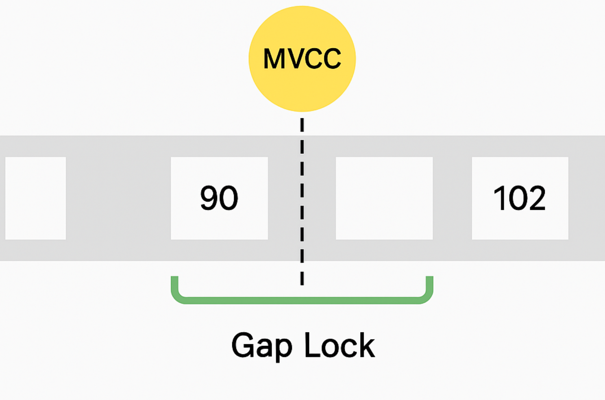

# 트랜잭션

트랜잭션이란?

- 트랜잭션은 작업의 완전성을 보장해준다.
- 즉, 논리적인 작업 셋을 모두 완벽하게 처리 OR 처리 못할 경우 원상태로 복구하여 일부만 적용되는 현상을 막아준다.


## MySQL에서의 트랜잭션

트랜잭션은 꼭 여러 개의 변경 작업을 수행하는 쿼리가 조합되었을때만 의미있는 개념은 아니다.

하나의 논리적 작업 셋에 쿼리가 1개건 2개건 상관없이 트랜잭션을 사용하여 작업의 완전성을 보장할 수 있다.


### 트랜잭션 관점에서 InnoDB와 MyISAM 테이블의 차이

```sql
CREATE TABLE table_myisam (
    id INT NOT NULL AUTO_INCREMENT PRIMARY KEY
) ENGINE=MyISAM;

INSERT INTO table_myisam (id) VALUES (3);
```
```sql
CREATE TABLE table_innodb (
    id INT NOT NULL AUTO_INCREMENT PRIMARY KEY
) ENGINE=InnoDB;

INSERT INTO table_innodb (id) VALUES (3);
```

위와 같이 테스트 테이블에 레코드 1개를 삽입한 이후 AUTO_COMMIT을 활성화하고 다음 쿼리를 실행해본다.

```sql
SET AUTOCOMMIT = ON;

INSERT INTO table_myisam (id) VALUES (1), (2), (3);
INSERT INTO table_innodb (id) VALUES (1), (2), (3);

[23000][1062] Duplicate entry '3' for key 'table_myisam. PRIMARY'
[23000][1062] Duplicate entry '3' for key 'table_innodb. PRIMARY'

```
table_myisam 

| id |
| :--- |
| 1 |
| 2 |
| 3 |

table_innodb

| id |
| :--- |
| 3 |


두 문장 모두 PK 중복 오류로 쿼리가 실패하였는데 서로 다른 결과값을 조회할 수 있었다.
즉, MyISAM 테이블에 INSERT 쿼리가 실행되며 차례대로 1과 2를 저장하고 3을 저장하려는 순간 에러가 발생하였다.

반대로 InnoDB는 쿼리 중 일부라도 오류가 발생하면 전체를 원 상태로 만드는 트랜잭션의 원칙대로 INSERT 쿼리 실행 전 상태로 복구했다.

MyISAM 테이블에서 발생한 이러한 현상을 Partial Update라고 표현하며 정합성을 맞추는데 까다로워진다.

## 주의사항
트랜잭션 또한 DBMS의 커넥션과 동일하게 꼭 필요한 최소의 코드에만 적용하는 것이 좋다!

아래 예제를 통해 살펴보자
1. 처리 시작 
   2. DB 커넥션 생성
   3. 트랜잭션 시작  
4. 사용자의 로그인 여부 확인
5. 사용자의 글쓰기 내용 오류 여부 확인
6. 첨부로 업로드된 파일 확인 및 저장
7. 사용자 입력 내용 DB에 저장
8. 첨부파일 정보 DB에 저장
9. 저장된 내용 또는 기타 정보 DB에 조회
10. 게시물 등록에 대한 알림 메일 발송
11. 알림 메일 발송 이력 DB에 저장
    12. 트랜잭션 종료
    13. DB 커넥션 반납
14. 처리 완료


위 처리 절차 중 DB 트랜잭션 처리에 좋지 않은 영향을 미치는 부분을 나눠서 확인해보자

- DB 커넥션을 생성하는 코드를 1번과 2번 사이에 넣어둔 뒤 START TRANSACTION 명령으로 트랜잭션을 시작한다. 그리고 9번과 10번 사이에 COMMIT 후 커넥션을 종료한다.
- 실제 DB에 데이터를 저장하는 작업은 5번부터 시작되는데 2, 3, 4번의 절차가 아무리 빠르더라도 DB 트랜잭션에 포함시킬 필요가 없다.
- 트랜잭션 커넥션은 일반적으로 개수가 제한적이어서 커넥션 소유 시간이 길어질 수록 여유 커넥션의 개수는 줄어들 것이다.

- 더 큰 위험은 8번 작업이다. 메일 전송이나 파일 전송 작업 등 네트워크를 통해 원격 서버와 연결하는 작업은 트랜잭션에 포함시키지 않는 것이 좋다!
- 만약 프로그램이 실행되는 동안 메일 서버에 문제가 생긴다면? 웹 서버 뿐 아니라 DB 서버까지 위험해질 수 있다.

위 처리 절차에는 DB 작업이 크게 4개가 있다.
1. 사용자가 입력한 정보를 저장하는 5, 6번 작업은 반드시 하나로 묶어야한다.
2. 7번 작업은 저장된 데이터를 단순 확인 및 조회이므로 반드시 넣을 필요는 없다.
3. 9번 작업은 성격이 ㄷ다르기에 이전 트랜잭션(5, 6번)과 묶지 않아도 무방할 수 있다. 따라서 이러한 작업은 별도 트랜잭션으로 분리하는 것이 좋다.
4. 추가로 7번이 단순 조회라면 트랜잭션을 사용하지 않아도 된다.

따라서 위 처리 절차를 다음과 같이 변경할 수 있다.

1. 처리 시작
2. 사용자의 로그인 여부 확인 
3. 사용자의 글쓰기 내용 오류 여부 확인 
4. 첨부로 업로드된 파일 확인 및 저장
   5. DB 커넥션 생성
   6. 트랜잭션 시작
7. 사용자 입력 내용 DB에 저장
8. 첨부파일 정보 DB에 저장
   9. 트랜잭션 종료(COMMIT)
10. 저장된 내용 또는 기타 정보 DB에 조회
11. 게시물 등록에 대한 알림 메일 발송
    12. 트랜잭션 시작
13. 알림 메일 발송 이력 DB에 저장
    14. 트랜잭션 종료
    15. DB 커넥션 반납
16. 처리 완료

구현하고자하는 업무 특성에 따라 다를 수 있지만 결국 핵심은 아래와 같다.

- 프로그램의 코드가 DB 커넥션을 가지고 있는 범위와 트랜잭션이 활성화돼 있는 프로그램의 범위를 최소화 해야한다.
- 네트워크 작업이 있는 경우 반드시 트랜잭션에서 배제해야한다!

-> 위와 같은 실수가 DB 서버에 부하를 주고 위험한 상태에 빠질 수 있는 경우가 빈번히 발생한다.


# MySQL 엔진의 잠금

MySQL에서 사용되는 잠금은 크게 아래와 같이 나눌 수 있다.

- 스토리지 엔진 레벨
- MySQL 엔진 레벨
  - (MySQL 엔진은 MySQL 서버에서 스토리지 엔진을 제외한 나머지 부분)

MySQL 엔진 레벨의 잠금은 모든 스토리지 엔진에 영향을 미치지만, 스토리지 엔진 레벨의 잠금은 스토리지 엔진 간 상호 영향을 미치지 않는다.

MySQL 엔진에서는 테이블 데이터 동기화를 위한 **테이블 락** 이외에도 테이블 구조를 잠그는 **메타데이터 락** 그리고 사용자 필요에 맞게 사용할 수 있는 **네임드 락**을 제공한다.


## 글로벌 락

**글로벌락**은 **FLUSH TABLES WITH READ LOCK** 명령으로 획득할 수 있으며 **MySQL에서 제공하는 잠금 중 가장 범위가 크다.**

일단 한 세션에서 글로벌 락을 획득하면 다른 세션에서 SEELECT를 제외한 대부분의 DDL, DML 문장을 실행하는 경우 글로벌 락이 해제될 때 까지 해당 문장이 대기 상태로 남는다.

미치는 영향: MySQL 서버 전체 테이블, 데이터베이스가 다르더라도 영향을 미침

FLUSH TABLES WITH READ LOCK은 모든 변경 작업을 멈추는데 InnoDB가 기본 스토리지 엔진이 되면서 조금 더 가벼운 글로벌 락의 필요성이 생겼다.

XtraBackup, Enterprise Backup과 같은 백업 툴들의 안정적인 실행을 위해 백업 락이 도입됐다.

```sql
LOCK INSTANCE FOR BACKUP;
-- 백업 실행
UNLOCK INSTANCE;
```

특정 세션에서 백업 락을 획득하면 모든 세션에서 테이블 스키마나 사용자 인증 관련 정보를 변경할 수 없게 된다.

- 데이터베이스 및 테이블 등 모든 객체 생성 및 변경, 삭제
- REPAIR TABLE, OPTIMIZE TABLE 명령
- 사용자 관리 및 비밀번호 변경

하지만 백업 락은 일반적인 테이블의 데이터 변경은 허용된다. 


## 테이블 락
테이블 락(Table Lock)은 개별 테이블 단위로 설정되는 잠금이며, 명시적 또는 묵시적으로 특정 테이블의 락을 획득할 수 있다.

### 명시적 획득
명시적으로는 "LOCK TABLES table_name [READ|WRITE]" 명령으로 획득할 수 있다.

테이블 락은 MyISAM 뿐만 아니라 InnoDB 스토리지 엔진을 사용하는 테이블도 동일하게 설정 가능하다.
명시적 획득 락은 UNLOCK TABLES 명령으로 해제할 수 있다.

단, 명시적 테이블 락은 특별한 상황이 아니라면 애플리케이션에서 사용할 필요가 거의 없는데, 글로벌 락과 마찬가지로 온라인 작업에 상당한 영향을 미치기 때문이다.

### 묵시적 획득
MyISAM, MEMORY 테이블에 데이터를 변경하는 쿼리를 실행하면 발생한다.

MySQL 서버가 데이터가 변경되는 테이블에 잠금을 설정하고 데이터를 변경한 후 즉시 잠금을 해제하는 형태로 사용된다.
즉, 쿼리가 실행되는 동안 자동 획득 이후 자동 해제된다. 

하지만 InnoDB 테이블은 스토리지 엔진 차원에서 레코드 기반 잠금을 제공하기에 단순 데이터 변경 쿼리로 묵시적 테이블 락이 설정되지 않는다.
자세히는 테이블 락이 설정되지만, 대부분 DML 쿼리에서는 무시되고 DDL에만 영향을 미친다.

## 네임드 락
네임드 락은 GET_LOCK() 함수를 사용해 임의의 문자열에 대해 잠금을 설정할 수 있다.
이 락의 특징은 대상이 테이블, 레코드 또는 AUTO_INCREMENT와 같이 객체가 아니라는 것이다.

단순 사용자가 지정한 문자열(String)에 대해 획득하고 반납하는 잠금이며 자주 사용되지는 않는다.

예시로 데이터베이스 서버 1대에 5대의 웹 서버가 접속해서 서비스하는 상황에서 5대의 웹 서버가 어떤 정보를 동기화해야하는 요건처럼 여러 클라이언트가 상호 동기화해야할 때 네임드락을 이용하여 쉽게 해결할 수 있다.

```sql
SELECT GET_LOCK('lock_name', 10); 
--(10초 대기)

-- "lock_name"이라는 문자열에 락이 걸려있는지 확인
SLECT IS_FREE_LOCK('lock_name');

-- 락 해제
SELECT RELEASE_LOCK('lock_name');

-- 위 함수 모두 정상적으로 락을 획득하거나 해제한 경우에는 1, 아니면 NULL or 0을 반환한다.
```

또한 많은 레코드에 대해 복잡한 요건으로 레코드를 변경하는 트랜잭션에 유용하게 쓸 수 있다.
batch job처럼 대량 레코드를 변경하는 쿼리는 데드락을 유발할 수 있는데 실행 시간을 분산하거나 코드를 수정하여 데드락을 최소화할 수 있지만 간단하지도 않고 best practice도 아니다.

이러한 경우 동일 데이터를 변경하거나 참조하는 프로그램끼리 분류하여 네임드락을 거고 쿼리를 실행하면 간단히 해결할 수 있다.

MySQL 8.0부터는 네임드 락을 중첩하여 사용할 수 있고 현재 세션에서 획득한 네임드 락을 한 번에 모두 해제할 수도 있다.

```sql
SELECT GET_LOCK('lock_name_1', 10);

SELECT GET_LOCK('lock_name_2', 10);

SELECT REALEASE_LOCK('lock_name_1');
SELECT REALEASE_LOCK('lock_name_2');

-- 동시에 모두 해제
SELECT RELEASE_ALL_LOCKS();
```

## 메타데이터 락
메타데이터 락은 데이터베이스 객체의 이름이나 구조를 변경하는 경우 획득하는 잠금이다.
명시적으로 획득하거나 해제할 수 있는 것이 아니고 "RENAME TABLE table_a to table_b"와 같이 테이블 이름을 변경하는 경우 자동으로 획득하는 잠금이다.
RENAME TABLE 명령의 경우 원본 이름과 변경ㄷ될 이름 두 개 모두 한꺼번에 잠금을 설정하며 실시간으로 테이블을 바꿔야하는 요건이 batch job에서 자주 발생하는데 아래 예제로 살펴보겠다.

```sql
-- batch job에서 별도의 임시 테이블(rank_new)에 서비스용 랭킹 데이터 생성
-- 랭킹 배치가 완료도디면 현재 서비스용 랭킹 테이블(rank)을 rank_backup으로 백업하고 새로 만들어질 테이블을 서비스용으로 대체
RENAME TABLE rank TO rank_backup, rank_new TO rank;
```

위와 같이 하나의 명령문에 두 개의 RENAME 작업을 한꺼번에 실행하면 "Table not found rank" 같은 상황을 발생시키지 않고 적용하는 것이 가능하다.
하지만 위 문장을 2개로 나눠서 실행하면 짧은 시간이지만 rank 테이블이 존재하지 않는 순간이 생기며 그 순간 "Table not found rank"라는 오류가 발생한다.

때로는 메타데이터 락과 InnoDB의 트랜잭션을 동시 사용해야할 케이스도 있다.

예를 들어 로그 테이블이 있었는데 테이블 구조를 변경해야한다면 Online DDL을 사용하여 변경할 수 있지만 시간이 오래걸린다면 언두 로그 증가, 버퍼 크기 등 고민해야할 문제가 생긴닫.
더 큰 문제는 DDL이 단일 스레드로 동작하기에 많은 시간이 소요될 것이다.

이때는 새로운 구조의 테이블을 생성하고 최근 데이터 까지 PK를 범위별로 나누어서 여러 스레드로 빠르게 복사한다.

그리고 나머지 데이터는 트랜잭션과 테이블 잠금, RENAME TABLE을 조합하여 처리한다.

## InnoDB 스토리지 엔진 잠금
InnoDB 스토리지 엔진은 기본 제공 잠금과 별개로 스토리지 엔진 내부에서 레코드 기반의 잠금 방식을 탑재하고 있다.

InnoDB는 레코드 기반의 잠금 방식때문에 MyISAM보다는 훨씬 뛰어난 동시성 처리를 제공하지만, 이원화된 잠금 처리 탓에 InnoDB 스토리지 엔진에서 사용되는 잠금에 대한 정보는 MySQL 명령을 이용해 접근하기 까다롭다.

서버에서는 lock_monitor와 SHOW ENGINE INNODB STATUS 명령을 통해 InnoDB의 잠금 정보를 확인할 수 있었는데 최근 버전에서는 information_schema 데이터 베이스에 존재하는 
- INNODB_TRX
- INNODB_LOCKS
- INNODB_LOCK_WAITS 

위 테이블을 조인하여 조회하면 현재 어떤 트랜잭션이 어떤 잠금을 대기하고 있고 해당 잠금을 어느 트랜잭션이 가지고 있는지 확인할 수 있고 장시간 잠금을 가지는 클라이언트를 찾아서 종료시킬 수도 있다!

InnoDB 스토리지 엔진은 레코드 기반 잠금을 제공하며, 상당히 작은 공간에서 잠금 정보를 관리하기에 레코드 락이 페이지락으로, 또는 테이블 락으로 레벨업(락 에스컬레이션)되는 경우는 없다.
일반 DBMS와 다르게 InnoDB에서는 레코드 락 뿐 아니라 레코드와 레코드 사이의 간격을 잠그는 갭 락이라는 것이 존자한다.

- [Shared and Exclusive Locks](https://dev.mysql.com/doc/refman/8.4/en/innodb-locking.html#innodb-shared-exclusive-locks) 
- [Intention Locks](https://dev.mysql.com/doc/refman/8.4/en/innodb-locking.html#innodb-intention-locks) 
- [Record Locks](https://dev.mysql.com/doc/refman/8.4/en/innodb-locking.html#innodb-record-locks) 
- [Gap Locks](https://dev.mysql.com/doc/refman/8.4/en/innodb-locking.html#innodb-gap-locks)
- [Next-Key Locks](https://dev.mysql.com/doc/refman/8.4/en/innodb-locking.html#innodb-next-key-locks)
- [Insert Intention Locks](https://dev.mysql.com/doc/refman/8.4/en/innodb-locking.html#innodb-insert-intention-locks)
- [AUTO-INC Locks](https://dev.mysql.com/doc/refman/8.4/en/innodb-locking.html#innodb-auto-inc-locks)
- [Predicate Locks for Spatial Indexes](https://dev.mysql.com/doc/refman/8.4/en/innodb-locking.html#innodb-predicate-locks)

### 레코드 락
레코드 자체만 잠그는 것을 레코드 락이라하며 타 DBMS와 동일한 역할을 하지만 중요한 차이는 레코드 자체가 아니라 인덱스의 레코드를 잠그는 것이다.
인덱스가 하나도 없는 테이블이더라도 내부적으로 자동 생성된 클러스터 인덱스를 이용해 잠금을 설정하며 레코드 자체를 잠그느냐 인덱스를 잠그느냐는 상당히 크고 중요한 차이를 만들어낸다.

InnoDB에서는 대부분 보조 인덱스를 이용한 변경작업은 이어서 설명할 Next key lock or Gap lock을 사용하지만 PK 또는 UNIQUE 인덱스를 이용한 변경작업은 갭에 대해서 잠그지 않고 레코드 자체에 대해서만 락을 건다.

### 갭 락
다른 DBMS와 또 다른 차이가 갭 락인데 레코드 자체가 아니라 레코드와 바로 인접한 레코드 사이의 간격만을 잠그는 것을 의미한다.
갭 락의 역할은 레코드와 레코드 사이의 간격에 새로운 레코드가 생성되는 것을 제어하는 것이며 그 자체보다는 넥스트 키 락의 일부로 자주 사용된다.

### 넥스트 키 락
레코드 락과 갭락을 합쳐놓은 형태의 잠금을 넥스트 키 락이라고 한다.
STATEMENT 포맷의 바이너리 로그를 사용하는 MySQL 서버에선 Repeatable Read 격리 수준을 사용해야한다. 또한 innodb_locks_unsafe_for_binlog 변수를 0으로 설정하면 변경을 위해 검색하는 레코드엔 넥스트 키 락을 설정하고 검색된 레코드에 대해서는 레코드 락이 걸린다.
갭 락이나 넥스트 키 락은 바이너리 로그에 기록되는 쿼리가 레플리카 서버에 실행될 때 소스 서버에서 만들어낸 결과와 동일한 결과를 만들어 내도록 보장하는 것이 주 목적이다.

하지만 의외로 넥스트 키 락과 갭락으로 데드락이 발생하거나 다른 트랜잭션을 기다리게 하는 일이 자주 발생한다. 가능하면 바이너리 로그 포맷을 ROW 형태로 바꾸어 넥스트 키 락이나 갭 락을 줄이자.

### 자동 증가 락
MySQL에서는 자동 증가하는 숫자 값을 추출하기 위해 AUTO_INCREMENT란 속성을 제공하는데 해당 컬럼이 사용된 테이블에 동시에 여러 레코드가 Insert되는 경우, 저장되는 각 레코드는 중복되지 않고 저장된 순서대로 증가하는 일련 번호 값을 가져야한다.
InnoDB 스토리지 엔진에서는 이를 위해 내부적으로 **AUTO_INCREMENT 락**을 사용한다.

AUTO_INCREMENT 락은 INSERT, REPLACE 쿼리 문장과 같이 새로 레코드를 저장하는 쿼리에만 필요하며 UPDATE, DELETE엔 걸리지 않는다. 
다른 락과 달리 트랜잭션과 관계없이 AUTO_INCREMENT 값을 가져오는 순간만 락이 걸렸다 즉시 해제된다.

AUTO_INCREMENT 락은 테이블에 단 하나만 존재하기에 두 개의 INSERT 쿼리가 동시에 실행될 때 하나의 쿼리가 AUTO_INCREMENT 락을 획득하고 나면 다른 쿼리는 대기 상태가 된다.

해당 락은 명시적으로 획득하고 해제하는 방법이 없고 아주 짧은 시간동안 걸렸다 해제되어 대부분 문제가 되지 않는다.

MySQL 5.1 이상부터는 innodb+autoinc_lock_mode 변수를 통해 AUTO_INCREMENT 락의 작동 방식을 변경할 수 있다.

- 0
  - AUTO_INCREMENT 락을 사용한다.
- 1
  - AUTO_INCREMENT 락을 사용하지 않는다.
  - 훨씬 가볍도 빠른 래치(뮤텍스)를 이용해 처리하며 개선된 래치는 자동 증가 락과 달리 아주 짧은 시간동안 잠금을 걸고 필요한 값을 가져오면 즉시 잠금 해제
  - INSERT ... SELECT 와 같이 예측할 수 없을 시에는 자동 증가 락 사용
  - AKA Consecutive mode
- 2
  - 절대 자동 증가 락을 사용하지 않고 래치를 사용한다.
  - 하나의 INSERT 문장으로 INSERT되는 레코드이더라도 연속된 자동 증가 값을 보장하지 않는다.
  - AKA Interleaved mode
  - INSERT...SELECT와 같이 대량 INSERT이 실행될때도 다른 커넥션은 INSERT를 사용할 수 있기에 동시 처리 성능 높음
  - 단, 자동 증가 기능은 유니크한 값이 생성되는 것만 보장
  - STATEMENT 포맷의 바이너리 로그를 사용하는 복제에선 소스 서버와 레플리카 서버의 자동 증가 값이 달라질 수도 있기에 주의!


위 설정값의 기본 값은 5.7까진 1이고 8.0부터는 2로 바뀌었다. 
이유는 8.0부터 바이너리 로그 포맷이 ROW로 바뀌었기 때문이며 만약 STATEMENT 포맷의 바이너리 로그를 사용한다면 2가 아닌 1로 설정할 것을 권장


## 인덱스와 잠금
인덱스와 락은 상당히 중요한 연관 관계가 있다. InnoDB의 잠금은 레코드를 잠그는게 아니라 인덱스를 잠그는 방식으로 처리한다.

즉, 변경해야할 레코드를 찾기 위해 검색한 인덱스의 레코드를 모두 락을 걸어야한다.

```sql
-- employee 테이블에 first_name 컬럼만 멤버로 담긴 ix_firstname이란 인덱스가 있다.
-- KEY ix_firstname(first_name)
-- first_name = 'John'인 사원은 전체 100명이고 first_name이 'John' 이면서 last_name이 'Smith'인 사원은 1명이다.

SELECT COUNT(*) 
FROM employee
WHERE first_name = 'John';
-- 100

SELECT COUNT(*)
FROM employee
WHERE first_name = 'John' AND last_name = 'Smith';
-- 1

-- employee 테이블에서 John Smith인 사원의 입사 일자를 오늘로 변경하는 쿼리를 실행해보자.
    
UPDATE employee
SET hire_date = NOW()
WHERE first_name = 'John' AND last_name = 'Smith';
```

UPDATE 문장이 실행되면 1건의 레코드가 업데이트 될 것인데 이 1건의 업데이트를 위해 몇 개의 레코드에 락을 걸어야 할까?

위 UPDATE 문장의 조건에서 인덱스를 이용할 수 있는 조건은 first_name = 'John' 뿐이다. last_name에는 인덱스가 없기에 first_name이 John인 모든 레코드 100개가 잠긴다.

만약 인덱스가 하나도 없는 테이블이라면? 테이블을 풀 스캔하며 UPDATE 작업을 하며 만약 해당 테이블의 레코드가 10만건이라면 모든 레코드를 잠그게 된다.


## 레코드 수준의 잠금 확인 및 해제
InnoDB 스토리지 엔진을 사용하는 테이블의 레코드 수준 잠금은 테이블 수준의 잠금보다 조금 더 복잡하다.
테이블 잠금에서 잠금의 대상이 테이블 자체이기에 쉽게 문제의 원인이 발견되고 해결할 수 있지만 레코드 수준 잠금은 테이블의 레코드 각각에 락이 걸리고 자주 사용되지 않는다면 오랜시간 잠겨있어도 발견되기 어렵다.

다만, 5.1 버전부터 레코드 잠금과 잠금 대기에 대한 조회가 가능하기에 바로 확인할 수 있다.
information_schema 데이터베이스에 존재하는 INNODB_TRX, INNODB_LOCKS, INNODB_LOCK_WAITS 테이블을 조인하여 현재 어떤 트랜잭션이 어떤 잠금을 대기하고 있고 해당 잠금을 어느 트랜잭션이 가지고 있는지 확인할 수 있다.

하지만 8.0버전부터 조금씩 deprecated되고 있으며 대신 performance_schema의 data_locks와 data_lock_waits 테이블로 대체되고 있다.


# MySQL의 격리 수준
트랜잭션의 격리 수준(Isolation Level)은 트랜잭션이 여러개 동시에 처리될 때 특정 트랜잭션이 다른 트랜잭션에서 변경하거나 조회하는 데이터를 볼 수 있게 허용할지 말지 결정하는 것이다.

- READ UNCOMMITTED
- READ COMMITTED
- REPEATABLE READ
- SERIALIZABLE

4가지로 나뉘는데 dirty read라고도 하는 READ UNCOMMITTED는 거의 사용하지 않고 SERIALIZABLE은 동시성이 중요한 DB에선 거의 사용되지 않는다.

4개의 격리 수준에서 순서대로 뒤로 갈수록 각 트랜잭션 간 데이터 격리 정도가 높아지며, 동시 처리 성능도 떨어지는 것이 일반적이다.
격리수준이 높아질 수록 처리 성능이 많이 떨어질 것이라 생각할 수 있지만 사실 SERIALIZABLE이 아니라면 크게 차이가 나지 않는다.

격리수준과 함께 언급되는 세 가지 부정합의 문제점이 있는데 이 세가지 부정합 문제는 격리 수준 레벨에 따라 다르다.

|                  | DIRTY READ | NON-REPEATABLE READ | PHANTOM READ |
|------------------|------------|---------------------|--------------|
| READ UNCOMMITTED | O          | O                   | O            |
| READ COMMITTED   | X          | O                   | O            |
| REPEATABLE READ  | X          | X                   | O (InnoDB X) |
| SERIALIZABLE     | X          | X                   | X            |


SQL-92, SQL-99 표준에는 REPEATABLE READ 격리 수준에선 팬텀 리드가 발생할 수 있지만 InnoDB 특성때문에 발생하지 않는다.

일반적인 서비스에선 READ COMMITTED와 REPEATABLE READ 격리 수준을 많이 사용하며, 오라클에선 주로 READ COMMITTED 격리 수준을 사용한다.
MySQL에선 REPEATABLE READ를 많이 사용한다. 

## READ UNCOMMITTED

| Timeline | Transaction A                                                                 | Transaction B                                                        |
|----------|--------------------------------------------------------------------------------|------------------------------------------------------------------------|
| T1       | START TRANSACTION;                                                             |                                                                        |
| T2       | SELECT balance FROM accounts WHERE id = 1;                                     |                                                                        |
|          | -- A 트랜잭션이 계좌의 현재 잔액을 조회함 (정상적인 SELECT)                         |                                                                        |
| T3       |                                                                                | START TRANSACTION;                                                    |
| T4       |                                                                                | UPDATE accounts SET balance = balance + 100 WHERE id = 1;             |
|          |                                                                                | -- B 트랜잭션이 같은 계좌의 잔액을 100 증가시킴                          |
| T5       | SELECT balance FROM accounts WHERE id = 1;                                     |                                                                        |
|          | *(Read uncommitted changes from Transaction B, dirty read)*                   |                                                                        |
|          | -- A 트랜잭션이 다시 같은 계좌의 잔액을 조회했는데, 이때 B가 커밋 안했음              |
|          | -- 즉, 아직 확정되지 않은 값(100 증가한 값)을 읽게 됨 → 더티 리드 발생                |
| T6       |                                                                                | ROLLBACK; *(Transaction B rolls back, Transaction A has read dirty data)* |
|          |                                                                                | -- B 트랜잭션 롤백: 증가시켰던 100원이 사라짐                          |
|          |                                                                                | -- 하지만 A 트랜잭션은 이미 잘못된 값(더티 데이터)을 읽은 상태           |
| T7       | COMMIT;                                                                       |                                                                        |
|          | -- A 트랜잭션이 잘못된 데이터를 기반으로 뭔가를 처리하고 커밋해버림                   |


위와 같이 어떤 트랜잭션이 처리하기도 전에 다른 트랜잭션이 변경한 데이터를 읽어버리는 경우를 더티 리드라고 한다.
더티 리드는 READ UNCOMMITTED 격리 수준에서만 발생하며, 데이터가 나타났다 사라졌다 하기에 RDBMS 표준에선 인정하지 않을 정도로 정합성에 문제가 많다.
예시로 Postgresql에선 READ UNCOMMITED 격리 수준이 READ COMMITTED와 동일하다.

[In PostgreSQL, you can request any of the four standard transaction isolation levels, but internally only three distinct isolation levels are implemented, i.e., PostgreSQL's Read Uncommitted mode behaves like Read Committed. This is because it is the only sensible way to map the standard isolation levels to PostgreSQL's multiversion concurrency control architecture.
](https://www.postgresql.org/docs/current/transaction-iso.html)


## READ COMMITTED
| Timeline | Transaction A                                                              | Transaction B                                                     |
|----------|-----------------------------------------------------------------------------|-------------------------------------------------------------------|
| T1       | START TRANSACTION;                                                         |                                                                   |
| T2       | SELECT balance FROM accounts WHERE id = 1;                                 |                                                                   |
| T3       |                                                                             | START TRANSACTION;                                               |
| T4       |                                                                             | UPDATE accounts SET balance = balance + 100 WHERE id = 1;        |
| T5       |                                                                             | COMMIT; *(Transaction B commits the changes)*                    |
| T6       | SELECT balance FROM accounts WHERE id = 1; *(Reads updated balance, non-repeatable read)* |                                                                   |
| T7       | COMMIT;                                                                    |                                                                   |


- A 트랜잭션은 처음에 id=1인 계좌의 잔액을 읽음. 
- 그 사이 B 트랜잭션이 값을 수정하고 커밋. 
- A 트랜잭션이 같은 SELECT를 다시 했을 때 값이 바뀜 → Non-Repeatable Read 발생 
- 이는 READ COMMITTED 수준에서 발생 가능. 
- REPEATABLE READ 이상에서는 방지됨 (MySQL 기본 격리 수준이기도 함).

위와 같이 부정합 현상(Non-Repeatable Read)은 일반 서비스에는 큰 문제가 아닐 수도 있지만 하나의 트랜잭션에 동일 데이터를 여러 번 읽고 변경하는 작업이 금전적인 처리와 연결되면 문제가 될 수 있다.


## REPEATABLE READ
| Timeline | Transaction A                                                         | Transaction B                                                          |
|----------|------------------------------------------------------------------------|------------------------------------------------------------------------|
| T1       | START TRANSACTION;                                                    |                                                                        |
| T2       | SELECT * FROM accounts WHERE balance > 1000;                          |                                                                        |
| T3       |                                                                        | START TRANSACTION;                                                    |
| T4       |                                                                        | INSERT INTO accounts (id, balance) VALUES (3, 1500);                   |
| T5       |                                                                        | COMMIT; *(Transaction B inserts a new row)*                           |
| T6       | SELECT * FROM accounts WHERE balance > 1000; *(Finds the newly inserted row)* |                                                                        |
| T7       | COMMIT;                                                               |                                                                        |


- A 트랜잭션이 특정 조건(balance > 1000)으로 검색 
- 그 사이 B 트랜잭션이 해당 조건에 해당하는 새로운 행을 추가하고 커밋. 
- A 트랜잭션이 다시 같은 조건으로 조회하면 새로운 행이 보임 → Phantom Read 발생 
- REPEATABLE READ에서도 발생할 수 있음 (특히 범위 조건일 때)
- SERIALIZABLE 격리 수준에서는 방지 가능.

REPEATABLE READ는 InnoDB 기본 격리 수준이며 바이너리 로그를 가진 MySQL 서버에선 최소 REPEATABLE READ를 사용해야 한다.
해당 격리 수준에선 Non-Repeatable read가 발생하지 않으며 InnoDB가 트랜젹신이 롤백될 가능성에 대비해 변경 전 레코드를 언두 공간에 백업해두고 레코드 값을 변경한다. (MVCC)

이 MVCC를 위해 언두 영역에 백업한 이전 데이터를 사용해 동일 트랜잭션 내에서는 동일한 결과를 보여줄 수 있게 보장한다.
사실 READ COMMITED도 MVCC를 이용해 COMMIT 되기 전 데이터를 보여주지만 둘의 차이는 언두 영역에 백업된 레코드의 여러 버전 가운데 몇 번째 이전 버전까지 찾아 들어가야 하느냐에 있다.

모든 InnoDB 트랜잭션엔 고유 transaction ID가 부여되며 언두 영역에 백업 데이터는 주기적으로 삭제한다. 
REAPEATABLE READ에선 MVCC를 보장하기 위해 실행 중 트랜잭션 가운데 가장 오래된 트랜잭션 보호보다 앞선 언두 영역의 데이터는 삭제할 수 없다.
그렇다고 가장 오래된 트랜잭션 번호 이전의 트랜잭션에 의해 변경된 모든 언두 데이터가 필요한 것은 아니며 정확하겐 특정 트랜잭션 번호 구간 내에서 백업된 언두 데이터가 보존돼야 한다.

## SERIALIZABLE

| Timeline | Transaction A                                                               | Transaction B                                                                  |
|----------|------------------------------------------------------------------------------|--------------------------------------------------------------------------------|
| T1       | START TRANSACTION;                                                          |                                                                                |
| T2       | SELECT * FROM accounts WHERE balance > 1000;                                |                                                                                |
| T3       |                                                                              | START TRANSACTION;                                                             |
| T4       |                                                                              | INSERT INTO accounts (id, balance) VALUES (3, 1500); *(Blocked, waiting for Transaction A to commit)* |
| T5       | COMMIT; *(Transaction A commits, releasing the lock)*                       |                                                                                |
| T6       |                                                                              | INSERT INTO accounts (id, balance) VALUES (3, 1500); *(Insertion succeeds)*   |
| T7       |                                                                              | COMMIT;                                                                        |


- InnoDB에서 REPEATABLE READ 격리 수준에서 Gap Lock이 작동하는 예시
- A 트랜잭션이 특정 범위 쿼리를 실행하면 InnoDB는 해당 범위(Gap)에 락을 걸어 삽입을 막음
- B 트랜잭션이 같은 조건을 만족하는 새로운 행을 INSERT 하려고 하면 대기 상태에 빠짐 (block) 
- A 트랜잭션이 끝나야만 B의 INSERT가 실행됨 → Phantom Read 방지 성공

가장 단순한 격리 수준이면서 가장 엄격한 격리 수준이다. 그만큼 동시 처리 성능도 다른 트랜잭션보다 떨어진다.
기본적으로 순수한 SELECT 작업은 아무런 레코드 락도 걸지않고 실행된다. [Non-locking consistent read](https://dev.mysql.com/doc/refman/8.4/en/innodb-consistent-read.html) 

하지만 격리수준이 SERIALIZABLE로 설정되면 SELECT 쿼리도 공유 잠금(읽기 잠금)을 획득해야하며 동시에 다른 트랜잭션은 그 레코드를 변경하지 못하게 된다.
PHANTOM READ가 발생하지 않지만 InnoDB에서는 갭 락과 넥스트 키 락 덕분에 REPEATABLE READ에서도 PHANTOM READ가 발생하지 않는다. 
-> 굳이 쓸 필요 없어보인다.


### 어떻게 REPEATABLE READ에서 PHANTOM READ가 발생하지 않을까?

#### 팬텀 리드(Phantom Read)란?
팬텀 문제는 트랜잭션 안에서 같은 쿼리를 두 번 실행했는데, 그 결과가 다를 때 발생한다.
예를 들어, 한 번은 결과가 없었는데, 두 번째에는 새로 생긴 행이 추가되어 결과에 나타난다면, 그 행을 **“팬텀(phantom)”**이라고 한다.

#### MySQL 예제 시나리오
가정: id > 100인 모든 행을 읽고 잠그고, 이후에 일부 행을 업데이트하고자 함.

```sql
SELECT * FROM child WHERE id > 100 FOR UPDATE;
```
위 쿼리는 id가 100보다 큰 첫 번째 레코드부터 인덱스를 순회하며 레코드를 읽고 잠근다.
예를 들어, 테이블에는 id = 90과 id = 102만 있다고 가정해보자.

이때 90과 102 사이의 **갭(gap)**에 대해 락이 걸리지 않으면, 다른 세션이 id = 101인 행을 삽입할 수 있다.
그러면 트랜잭션 내에서 동일한 SELECT를 다시 실행했을 때 id = 101이 새로 등장 → 팬텀 발생 

#### 해결 방법, Next-Key Lock
InnoDB는 이를 방지하기 위해 Next-Key Lock이라는 알고리즘을 사용
Next-Key Lock = 인덱스 레코드 락 + 갭 락(Gap Lock)

즉, 레코드 자체 + 그 앞에 있는 공간까지 락을 거는 구조
예를 들어, 어떤 세션이 id = 102를 잠그면 그 바로 앞 구간(예: 100~102)도 함께 잠긴다.

덕분에 다른 세션은 그 사이(예: 101)에 행을 삽입할 수 없게 된다.

#### 추가 설명
인덱스를 스캔할 때, 마지막 레코드 뒤의 갭까지도 락을 걸 수 있음.
ex) id > 100인 쿼리에서는 102 이후의 갭까지도 잠금 대상이 됨.

공유 잠금 모드로 읽고 중복이 없으면 INSERT 시도.
이때 후속 레코드에 걸린 Next-Key Lock이 동시 중복 삽입을 막아줌.

단, SELECT ... FOR UPDATE 혹은 SELECT ... FOR SHARE 쿼리는 팬텀 리드 현상이 발생할 수 있지만 레코드의 변경 이력(언두 레코드)에 잠금을 걸 수는 없기에 이러한 잠금을 동반한 SELECT 쿼리는 예외적 상황으로 볼 수 있다.

#### Gap Lock 비활성화?
MySQL에서 설정을 통해 Gap Lock을 비활성화할 수 있는데, 이렇게 되면 다른 세션이 갭에 자유롭게 삽입할 수 있어서 팬텀 문제가 다시 발생할 수 있음.


